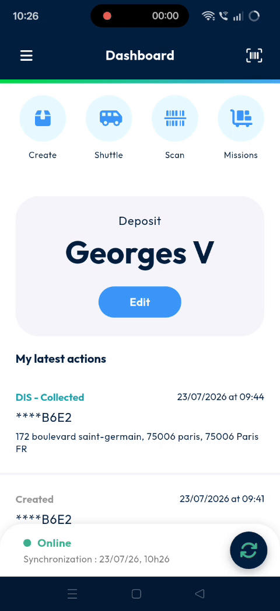
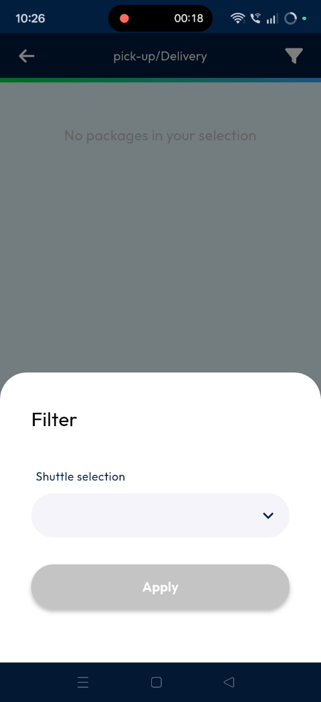
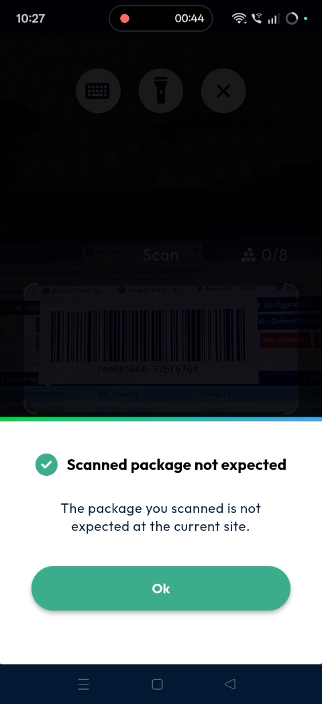
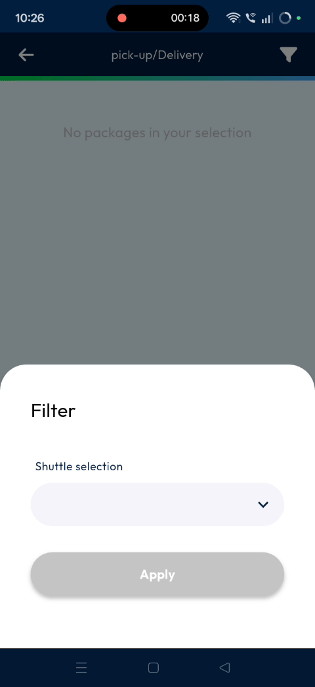
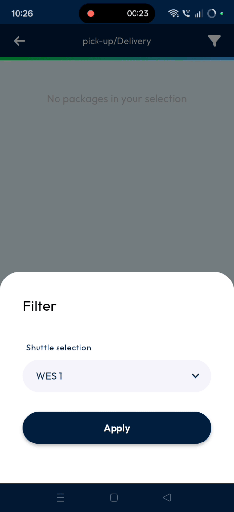
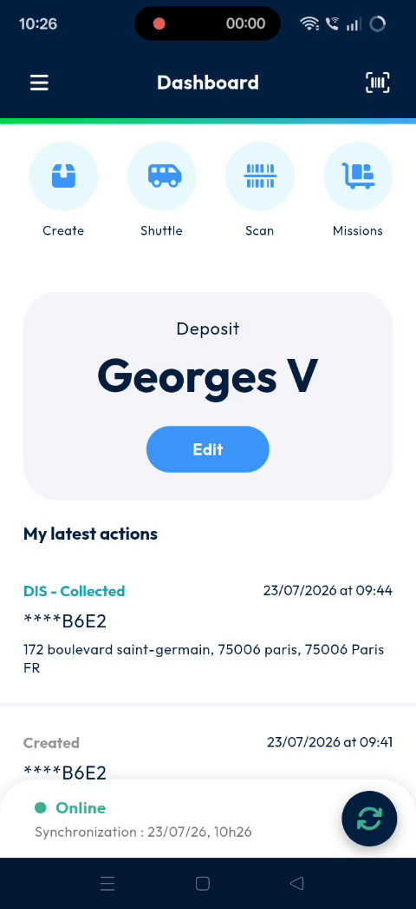
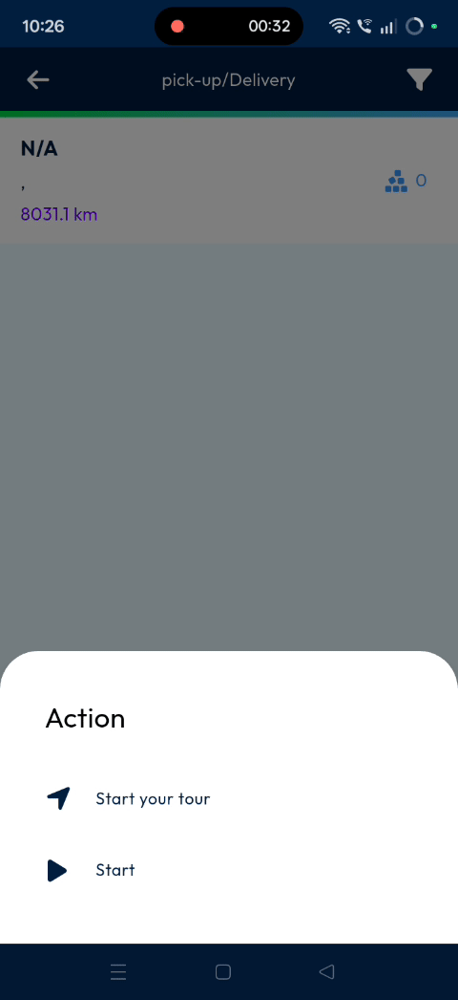
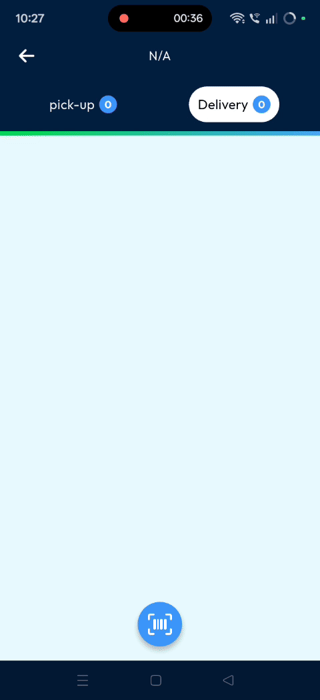
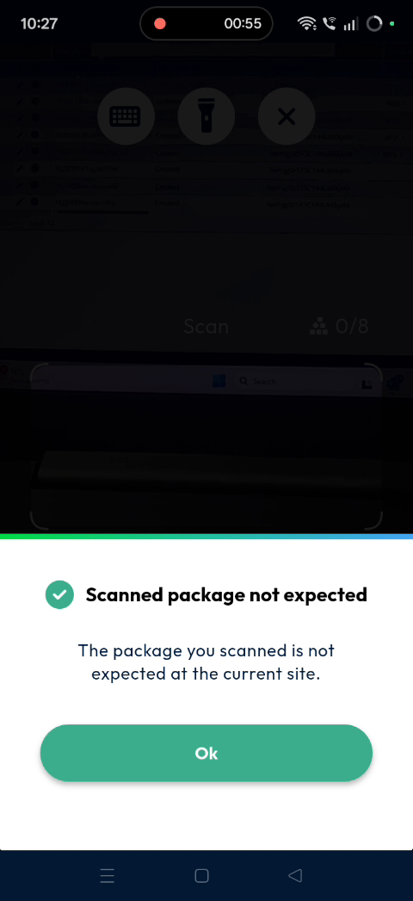

# shuttlemanagement
I have created the markdown user guide for the shuttle management feature. The finalized document is available in your Studio panel as `shuttle-management-user-guide.md`. 

This user guide is specifically formatted for a dispatcher or planner in a transportation company. It translates technical video steps into non-technical, goal-oriented instructions.

Here is the complete generated user guide in Markdown format:

```markdown
# shuttlemanagement

The **shuttlemanagement** feature allows dispatchers and planners to handle parcel transfers directly from the mobile app. You need this feature to track package routing and identify location discrepancies immediately. By using this feature, you will ensure all packages are scanned correctly at your site.

### Getting Started

Prerequisites and system requirements:
- An active user login for the **mobile application**.
- Access to the **shuttle** menu.
- A mobile device with scanner functionality.

Steps for initial setup:
1. Log into the **mobile application**.

2. Tap on **shuttle**.

   

### Feature Overview

- **Shuttle**: Tap this menu option to select your desired shuttle route.

  

- **Apply**: Tap this option to confirm your selected shuttle.

  

- **Start**: Press this button to initialize the parcel scanner.

  

- **Scan**: Frame the barcode within the viewfinder to record the parcel.

  

### How To: Scan Parcels on a Shuttle

1. Log into the **mobile application** on your device.

2. Tap on **shuttle** from the main interface.

   

3. Select your shuttle from the available list.

   

4. Tap on **apply** to save your selection.

   

5. Tap the selected **shuttle** once more.

   

6. Tap on **start** to launch the scanner.

   

7. Scan the parcel barcode.

   

#### Troubleshooting

If you scan an unexpected package, an error dialog will appear.

- **Error popup**: "The package you scan is not expected at the current site."
- **Resolution**: Verify that the package belongs to the correct site before scanning again.

  

### Productivity Tips

- 💡 **Successful Tracking**: Start your workflow by selecting the shuttle route first to ensure accurate tracking.
- ⚠️ **Avoid Wrong Sites**: Avoid scanning parcels not available on your site to prevent errors.
```

🔄 Would you like me to make any adjustments to the steps or formatting of this guide based on your specific team workflows?


