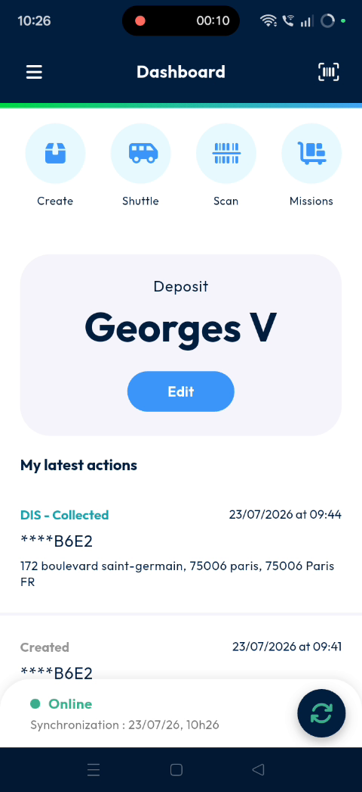
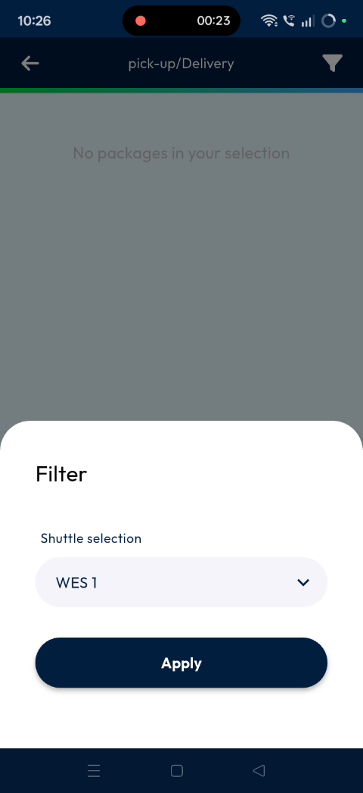
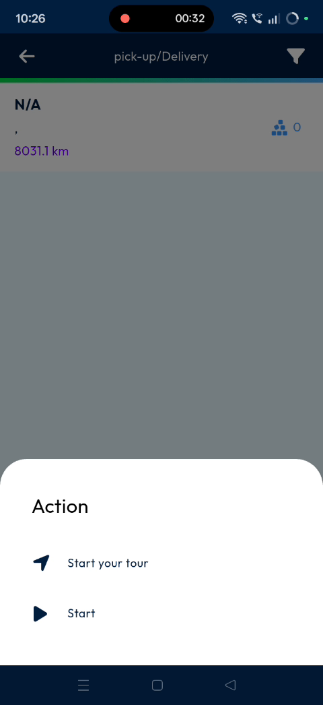
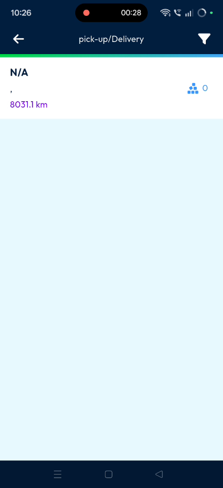
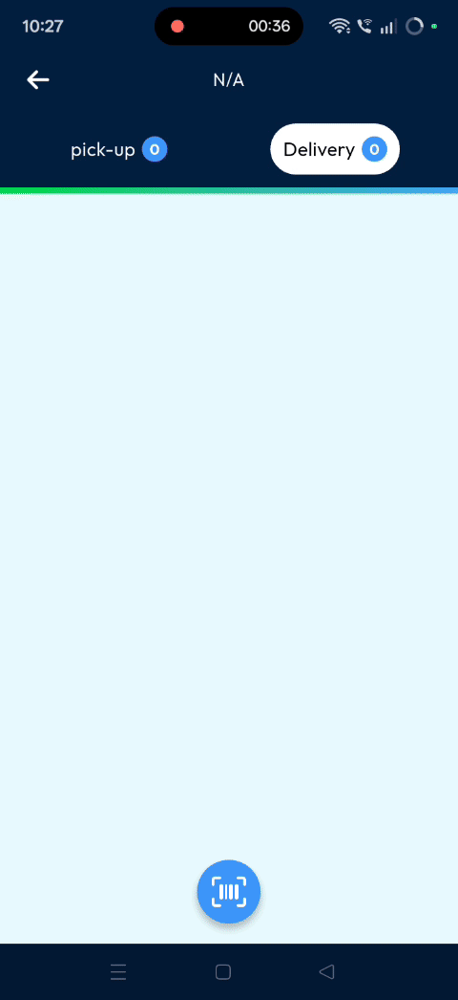

# shuttlemanagement
# shuttlemanagement

The **Shuttle Management** feature helps dispatchers manage shuttle routes on the mobile app. Select your shuttle, start the route, and scan parcels. This ensures all scanned parcels are expected at the current site.

### Getting Started

Prerequisites:
* **Nomadia Delivery** mobile application installed.
* Active login credentials.
* Assigned shuttle route.

1. Log into the **Nomadia Delivery** mobile application.

2. Tap on the **Shuttle** option.

### Feature Overview

* **Shuttle**: Opens the shuttle selection list. Use this to choose your assigned route.

* **Apply**: Confirms your shuttle selection. This registers your choice in the system.

* **Start**: Initiates the route and begins the scanning process. Use this to begin loading parcels.

* **Parcel Scanner**: Scans individual package barcodes. Use this to verify if the parcel is expected at your site.

### How To: Manage Shuttle and Scan Parcels

1. Tap on **Shuttle** from the main menu.

2. Select the designated shuttle from the list.

3. Tap on **Apply**.

4. Tap the selected shuttle row.

5. Tap on **Start**.

6. Scan the parcel.

#### Troubleshooting

If you receive an error popup during scanning:

* **Error**: The package is not expected.
* **Cause**: The scanned parcel is not available at this site.
* **Action**: Verify that you are scanning the correct package.

### Productivity Tips

* ⚠️ **Unexpected Package Warning**: Scanning parcels not on-site triggers a "not expected" popup error.

***

